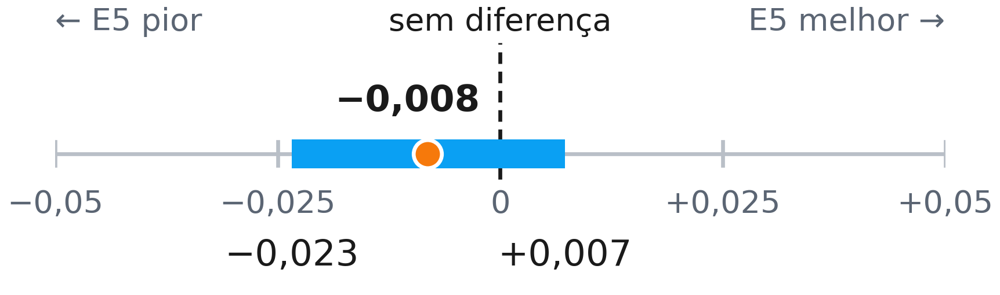

# Busca lexical (BM25) versus busca semântica (E5) nos metadados do REDU

Trabalho prático da disciplina de **Metodologia Científica** do mestrado em Ciência da Computação (Instituto de Computação, Unicamp).
Autora: Letízia Manuella.

O experimento compara dois métodos de busca na recuperação de conjuntos de dados do **REDU**, o Repositório de Dados de Pesquisa da Unicamp, a partir dos seus metadados públicos.

- **A: BM25**, ranqueamento padrão do Lucene, a biblioteca de busca usada pelo Solr, sobre o qual funciona a busca do Dataverse.
- **B: busca semântica** com o modelo `intfloat/multilingual-e5-small`.

---

## Pergunta e hipóteses

> A busca semântica posiciona o conjunto de dados correto em melhores posições do que o BM25?

- **Métrica principal:** MRR (*Mean Reciprocal Rank*), a média de 1/posição do conjunto correto.
- **H0:** MRR(BM25) = MRR(E5). **H1:** MRR(BM25) ≠ MRR(E5). Teste bilateral, α = 0,05.
- **Métrica secundária:** Hit@10, que indica se o conjunto correto aparece entre os 10 primeiros resultados.

Métricas, testes e nível de significância foram definidos **antes da coleta dos dados**.

## Resultado principal

| Métrica | BM25 (A) | E5 (B) | Teste | p-valor |
|---|---|---|---|---|
| MRR | 0,737 | 0,729 | Aleatorização pareada (100 mil permutações) | 0,29 |
| Mediana da posição | 1 | 1 | — | — |
| Hit@10 | 85,4% | 87,6% | McNemar *mid-p* | 0,004 |
| Tempo total (1 execução, CPU) | 1,7 s | 93 s | descritivo | — |

- Diferença de MRR (B − A): **−0,008**, com IC 95% por *bootstrap* de **[−0,023; +0,007]**. O intervalo inclui o zero, então **H0 não foi rejeitada**.
- Verificação: t pareado (p = 0,30) e Wilcoxon (p = 0,47) levam à mesma conclusão.
- No Hit@10, nas consultas em que só um método acertou, o E5 venceu 154 vezes e o BM25 venceu 108.

**Conclusão:** nesta tarefa, a busca semântica não superou o BM25 no MRR. Uma eventual diferença real seria pequena, e o E5 é bem mais lento. A vantagem do E5 no Hit@10 se concentra nas consultas cujas palavras não aparecem no texto do conjunto (ver a análise exploratória abaixo).



---

## Estrutura do repositório

```
.
├── tp_busca.py              # experimento completo: coleta, execução, análise e autoteste
├── exploratoria.py          # análise exploratória (pós-hoc) por sobreposição de vocabulário
├── requirements.txt
├── saida/                   # resultados da execução usada no relatório
│   ├── coleta_meta.json         # data da coleta e número de datasets
│   ├── ambiente.json            # versões, configuração, contagens e tempos
│   ├── resultados.json          # todos os números do teste confirmatório
│   ├── ranks.csv                # posição do conjunto correto em cada consulta, por método
│   ├── baixa_encontrabilidade.csv   # datasets que nenhum método colocou no top 10
│   ├── fig_resultados.png
│   ├── exploratoria.json        # resultados da análise exploratória
│   ├── exploratoria_por_consulta.csv
│   └── fig_exploratoria.png
└── figuras/
    ├── fig_ic_mrr.pdf / .png    # figura do relatório (intervalo de confiança)
    ├── fig_ic.py                # script que gera a figura do relatório
    └── grafico_IC_MRR.png       # versão usada nos slides
```

O arquivo `saida/redu_metadados.csv`, com os metadados coletados, **não** está no repositório, porque os termos de redistribuição não foram confirmados. Ele é recriado pelo comando `coletar`.

---

## Como reproduzir

Requer Python 3.12. Não precisa de placa de vídeo.

```
python -m venv .venv
.venv\Scripts\activate          # Windows (no Linux/macOS: source .venv/bin/activate)
pip install -r requirements.txt
```

| Comando | Resultado |
|---|---|
| `python tp_busca.py autoteste` | Roda tudo com dados falsos e deve terminar com `AUTOTESTE OK` |
| `python tp_busca.py coletar` | Coleta os metadados pela *Search API* do Dataverse e gera `saida/redu_metadados.csv` |
| `python tp_busca.py experimento` | Executa A e B e gera `saida/ranks.csv` (na 1ª vez, baixa o modelo E5, cerca de 0,5 GB) |
| `python tp_busca.py analisar` | Aplica os testes e gera `saida/resultados.json` |
| `python exploratoria.py` | Gera os arquivos `exploratoria*` |

**Atenção:** o REDU muda com o tempo. A coleta usada no relatório foi feita em **27/09/2026, às 14h06**, com 2.219 conjuntos publicados. Uma nova coleta pode trazer outros conjuntos e, portanto, números um pouco diferentes. Os sorteios do teste e do *bootstrap* usam semente fixa (`20260923`), então os mesmos dados sempre geram os mesmos resultados.

---

## Protocolo

- **Coleta:** todos os conjuntos publicados, pela *Search API* do Dataverse.
- **Busca de item conhecido** (adaptada de Azzopardi et al., 2007): as palavras-chave que o autor atribuiu a um conjunto formam a consulta, e esse conjunto (o **conjunto de origem**) é a única resposta correta. Só viram consulta os conjuntos com pelo menos 2 palavras-chave diferentes, o que resultou em **2.047 consultas** sobre **2.219 conjuntos**.
- **Índice:** apenas título + descrição. As palavras-chave ficam fora, senão a consulta encontraria o próprio texto.
- **A (BM25):** fórmula do Lucene, k1 = 1,2 e b = 0,75 (valores padrão). Sem *stemming* e sem remoção de palavras comuns, porque os metadados misturam português e inglês.
- **B (E5):** `intfloat/multilingual-e5-small` (licença MIT), com os prefixos `query:` e `passage:`, e similaridade de cosseno.
- **Posição:** posição do conjunto de origem entre os 2.219. Empates recebem a posição média.
- **Desenho pareado:** as mesmas consultas nos dois métodos. A comparação é feita pela diferença RR(B) − RR(A) em cada consulta.
- **Teste principal:** aleatorização pareada sobre a diferença de MRR, bilateral, α = 0,05, 100 mil permutações (Smucker, Allan e Carterette, 2007). IC 95% por *bootstrap* percentil, com 10 mil reamostragens (Efron e Tibshirani, 1993).
- **Verificação:** t pareado e Wilcoxon (que descarta as diferenças iguais a zero).
- **Secundário:** Hit@10 com McNemar *mid-p* (Fagerland, Lydersen e Laake, 2013). O p exato também é registrado. Limiar de Bonferroni para as duas métricas: 0,05/2 = 0,025.

## Análise exploratória (pós-hoc)

Feita **depois** de ver os resultados, para entender por que o E5 vence no Hit@10 sem vencer no MRR. Ela **não** substitui o teste confirmatório. As consultas foram divididas pela proporção das suas palavras que aparecem no título + descrição do conjunto de origem.

| Grupo | n | MRR A | MRR B | Hit@10 A | Hit@10 B |
|---|---|---|---|---|---|
| Nenhuma palavra presente | 142 | 0,001 | 0,259 | 0% | 38,7% |
| Parte das palavras | 1.682 | 0,767 | 0,741 | 90,7% | 90,3% |
| Todas as palavras | 223 | 0,981 | 0,939 | 100% | 98,7% |

Toda a vantagem do E5 no Hit@10 vem do primeiro grupo (55 acertos só do E5 e nenhum só do BM25). Nos outros dois grupos, o BM25 tem MRR maior. São 6 testes, então o limiar de Bonferroni é 0,05/6 ≈ 0,0083.

---

## Limitações e detalhes declarados

- **As consultas favorecem o BM25.** As palavras-chave dos autores costumam repetir termos do título e da descrição, e podem não representar as buscas de usuários reais.
- **O BM25 não é a configuração real do REDU.** O Dataverse 6.2 usa o Solr com pesos por campo e *stemming* em inglês. Aqui foi usado o BM25 padrão sobre título + descrição.
- **Apenas um modelo semântico**, na versão pequena. Modelos maiores podem ter outro desempenho.
- **Tempo:** medido uma única vez, de forma total, em CPU. Inclui a indexação e, no E5, o carregamento do modelo e a geração dos vetores dos 2.219 conjuntos. Serve só como referência.
- **Consultas repetidas:** 73 consultas são idênticas a outras (28 grupos, o maior com 13 conjuntos), em geral conjuntos de uma mesma série. Só o conjunto de origem conta como acerto. Sem essas consultas, a diferença de MRR passa de −0,008 para −0,009.
- **Separação de palavras:** o tokenizador remove alguns símbolos (travessão "–", apóstrofo curvo "’", "°") sem inserir espaço, unindo palavras (por exemplo, "Host–microbiome" vira "hostmicrobiome"). Isso afeta 186 documentos e 12 consultas. Corrigido, o MRR do BM25 iria de 0,7370 para 0,7373.
- **Termos repetidos na consulta:** são contados uma vez só, enquanto o Lucene conta todas as repetições. Com a contagem do Lucene, a diferença de MRR iria para −0,005.
- **Empates:** recebem a posição média, e o RR é calculado como 1/(posição média). Isso é levemente conservador para o BM25 (MRR +0,000075).
- **Contagem de datasets:** o site do REDU mostrava 2.164 datasets, e a *Search API* retornou 2.219 (todos com DOI único). A causa da diferença não foi identificada.

Nenhum desses pontos altera as conclusões.

## Ambiente da execução

Notebook com Intel Core Ultra 7 268V, 32 GB de RAM, Windows 11 Pro (25H2), execução em CPU. Python 3.12.10, sentence-transformers 6.1.0, PyTorch 2.14.0+cpu, SciPy 1.18.1, scikit-learn 1.9.1.

## Referências

- Azzopardi, L., de Rijke, M., Balog, K. (2007). Building simulated queries for known-item topics: an analysis using six European languages. *SIGIR 2007*. https://doi.org/10.1145/1277741.1277820
- Efron, B., Tibshirani, R. J. (1993). *An Introduction to the Bootstrap*. Chapman & Hall.
- Fagerland, M. W., Lydersen, S., Laake, P. (2013). The McNemar test for binary matched-pairs data: mid-p and asymptotic are better than exact conditional. *BMC Medical Research Methodology*, 13, 91.
- Robertson, S., Zaragoza, H. (2009). The probabilistic relevance framework: BM25 and beyond. *Foundations and Trends in Information Retrieval*, 3(4).
- Smucker, M. D., Allan, J., Carterette, B. (2007). A comparison of statistical significance tests for information retrieval evaluation. *CIKM 2007*. https://doi.org/10.1145/1321440.1321528
- Wang, L. et al. (2024). Multilingual E5 Text Embeddings: A Technical Report. arXiv:2402.05672.
- Wilkinson, M. D. et al. (2016). The FAIR Guiding Principles for scientific data management and stewardship. *Scientific Data*, 3, 160018.

## Licença

Código sob a licença MIT (ver `LICENSE`). Os metadados do REDU pertencem aos seus respectivos autores e ao repositório.
